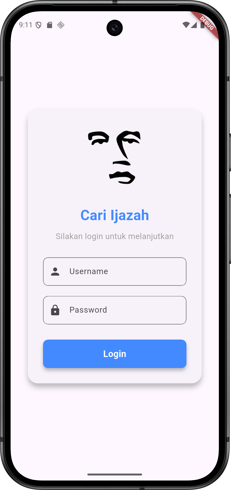
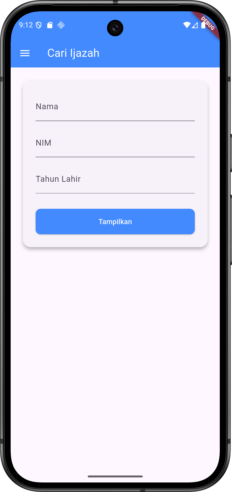
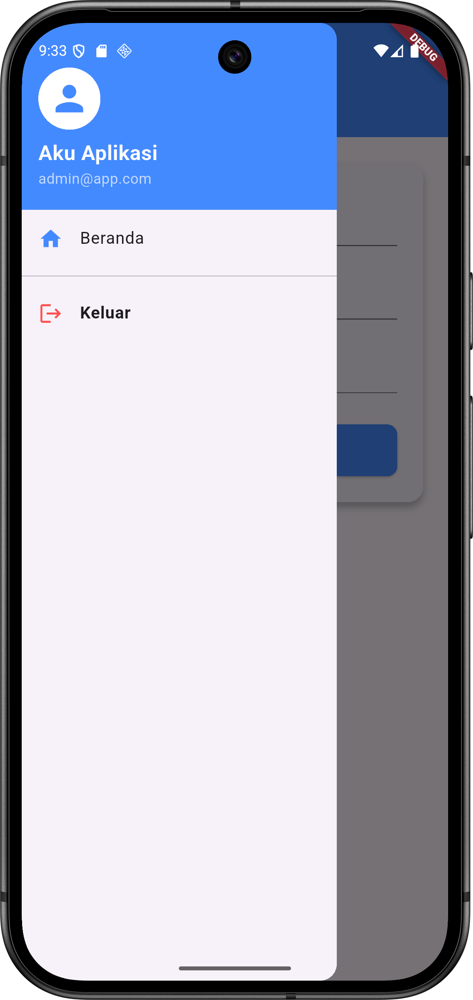
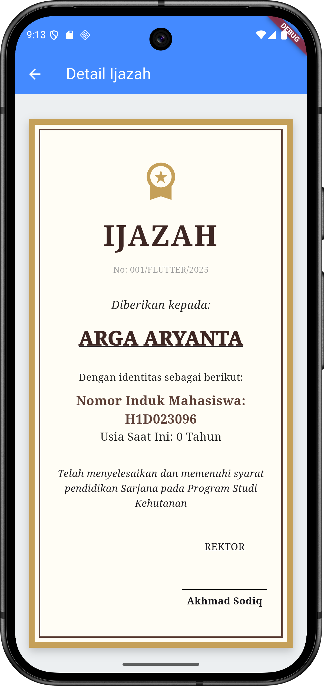

# H1D023096 - Arga Aryanta Indrafata

## Screenshot

### Login

   
  &nbsp;&nbsp;&nbsp;&nbsp; 
  

### Beranda & Hasil

   
  &nbsp;&nbsp;&nbsp;&nbsp;
   
  &nbsp;&nbsp;&nbsp;&nbsp; 
  

### Easter Egg
Tampilan rahasia banget ini hanya akan muncul jika input memenuhi kriteria berikut:
* **Nama:** jokowi (tidak sensitif huruf besar/kecil).
* **NIM:** 1681
* **Tahun Lahir:** 1961

   
  &nbsp;&nbsp;&nbsp;&nbsp;

---

## Penjelasan Kode

Berikut adalah alur logika utama dari implementasi kode aplikasi:

**1. Manajemen Sesi & Login (`main.dart` & `login_page.dart`)**
* **Pengecekan Sesi:** Pada `main.dart`, aplikasi menggunakan `FutureBuilder` untuk memeriksa status login yang tersimpan di `SharedPreferences` (local storage). Jika terdeteksi sudah login, aplikasi langsung mengarah ke halaman Form, jika belum, ke halaman Login.
* **Validasi Login:** Di `login_page.dart`, input divalidasi secara hardcoded (User: `admin`, Pass: `admin`).
* **Handling Error:** Jika login gagal, fungsi `_showErrorDialog` menampilkan `AlertDialog` kustom yang memuat gambar aset dan pesan kesalahan tanpa judul default.

**2. Navigasi & Menu (`sidebar.dart`)**
* Menggunakan widget `Drawer` untuk membuat menu samping (Side Menu).
* Fitur **Logout** bekerja dengan menghapus data sesi (`prefs.remove('is_login')`) dan menavigasi kembali ke halaman login menggunakan `Navigator.pushAndRemoveUntil` untuk membersihkan riwayat navigasi sebelumnya.

**3. Penginputan Data (`form_data.dart`)**
* Menggunakan `TextEditingController` untuk menangkap input Nama, NIM, dan Tahun Lahir.
* Melakukan kalkulasi umur sederhana (`Tahun Sekarang - Tahun Lahir`).
* **Passing Data:** Data yang diinput dikirim ke halaman berikutnya melalui *constructor* `TampilDataPage` menggunakan `Navigator.push`. Parameter `birthYear` (tahun lahir mentah) ikut dikirim secara spesifik untuk keperluan verifikasi *Easter Egg*.

**4. Logika Tampilan & Easter Egg (`tampil_data.dart`)**
* Halaman ini menerima data melalui *constructor* dengan parameter `required`.
* **Logika Kondisional (If-Else):** Di awal metode `build`, terdapat pengecekan logika. Jika `nama` mengandung kata "arga", `nim` adalah "1980", dan `tahun` adalah "2003", maka widget akan me-return tampilan khusus (*Easter Egg*) dengan latar hitam dan gambar `asli.jpg`.
* **Desain Sertifikat:** Jika kondisi di atas tidak terpenuhi, aplikasi merender tampilan standar berupa desain ijazah menggunakan teknik *nesting* `Container` dengan manipulasi `border` dan `boxShadow` untuk efek bingkai ganda.